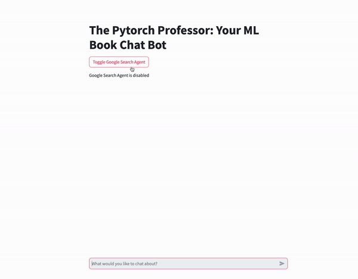

# The Pytorch Professor: Your ML Book Chat Bot

This project is a chatbot application built with Python, Pinecone, OpenAI, LangChain and Streamlit. The chatbot, named "The ML Professor", is designed to answer questions and engage in conversation about machine learning topics. The streamlit app is also hosted on Huggingface. 

## Features

- Interactive chat interface built with Streamlit
- Uses the GPT-3.5-turbo model from OpenAI for generating responses
- Option to enable or disable a Google search agent

## Getting Started

### Prerequisites

- Python 3.7 or later
- Streamlit
- OpenAI API key
- Pinecone API key

### Installation

1. Clone this repository:
git clone git@github.com:sgabriel92/EP596_LLM_MY_ML_PROFESSOR.git

2. Navigate to the project directory:
cd your-repository

3. Install the required dependencies:
pip install -r requirements.txt

4. Set up the environment variables:
export OPENAI_API_KEY=your-openai-api-key
export PINECONE_API_KEY=your-pinecone-api-key

5. Run the application:
streamlit run app.py

6. Open your web browser to `http://localhost:8501` to start using the chatbot.

## Contributing

Please read [CONTRIBUTING.md](CONTRIBUTING.md) for details on our code of conduct, and the process for submitting pull requests to us.

## License

This project is licensed under the MIT License - see the [LICENSE.md](LICENSE.md) file for details.

## Acknowledgments

- OpenAI for providing the GPT-3.5-turbo model
- Pinecone for their vector search platform

